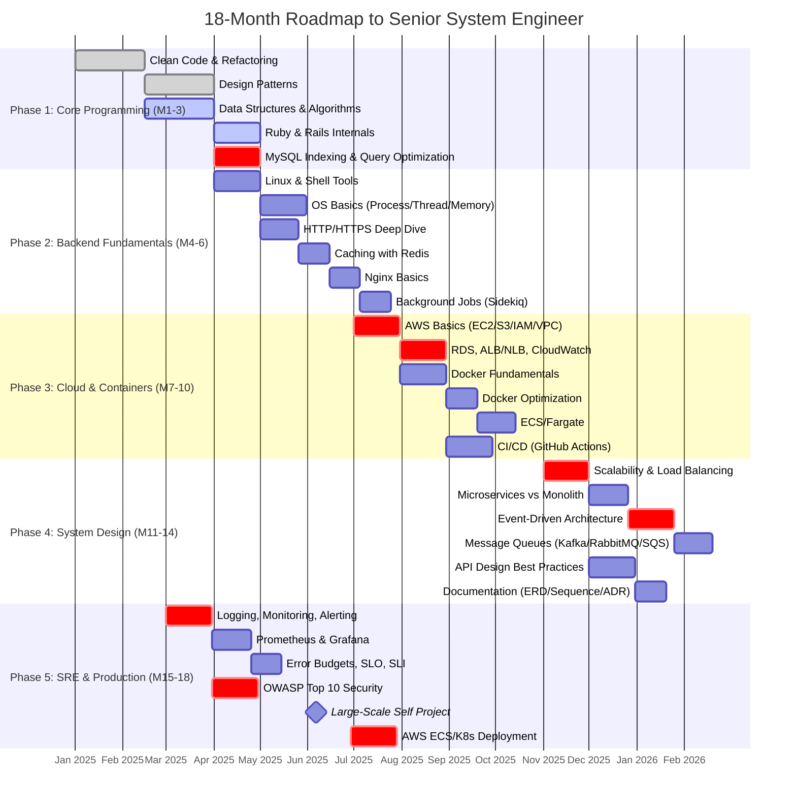
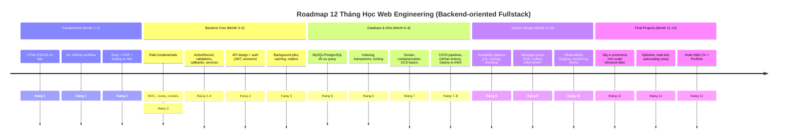

# Senior System Engineer Road Map

```mermaid
gantt
    title 18-Month Roadmap to Senior System Engineer
    dateFormat YYYY-MM-DD
    axisFormat %b %Y
    
    section Phase 1: Core Programming (M1-3)
    Clean Code & Refactoring           :done, p1a, 2025-01-01, 45d
    Design Patterns                    :done, p1b, after p1a, 45d
    Data Structures & Algorithms       :active, p1c, after p1a, 45d
    Ruby & Rails Internals             :active, p1d, after p1b, 30d
    MySQL Indexing & Query Optimization:crit, p1e, after p1c, 30d
    
    section Phase 2: Backend Fundamentals (M4-6)
    Linux & Shell Tools                :p2a, 2025-04-01, 30d
    OS Basics (Process/Thread/Memory)  :p2b, after p2a, 30d
    HTTP/HTTPS Deep Dive               :p2c, after p2a, 25d
    Caching with Redis                 :p2d, after p2c, 20d
    Nginx Basics                       :p2e, after p2d, 20d
    Background Jobs (Sidekiq)          :p2f, after p2e, 20d
    
    section Phase 3: Cloud & Containers (M7-10)
    AWS Basics (EC2/S3/IAM/VPC)        :crit, p3a, 2025-07-01, 30d
    RDS, ALB/NLB, CloudWatch           :crit, p3b, after p3a, 30d
    Docker Fundamentals                :p3c, after p3a, 30d
    Docker Optimization                :p3d, after p3c, 20d
    ECS/Fargate                        :p3e, after p3b p3d, 25d
    CI/CD (GitHub Actions)             :p3f, after p3c, 30d
    
    section Phase 4: System Design (M11-14)
    Scalability & Load Balancing       :crit, p4a, 2025-11-01, 30d
    Microservices vs Monolith          :p4b, after p4a, 25d
    Event-Driven Architecture          :crit, p4c, after p4b, 30d
    Message Queues (Kafka/RabbitMQ/SQS):p4d, after p4c, 25d
    API Design Best Practices          :p4e, after p4a, 30d
    Documentation (ERD/Sequence/ADR)   :p4f, after p4e, 20d
    
    section Phase 5: SRE & Production (M15-18)
    Logging, Monitoring, Alerting      :crit, p5a, 2025-03-01, 30d
    Prometheus & Grafana               :p5b, after p5a, 25d
    Error Budgets, SLO, SLI            :p5c, after p5b, 20d
    OWASP Top 10 Security              :crit, p5d, after p5a, 30d
    Large-Scale Self Project           :milestone, p5e, after p5c p5d, 45d
    AWS ECS/K8s Deployment             :crit, p5f, after p5e, 30d
```

```mermaid
timeline
    title Roadmap 12 Tháng Học Web Engineering (Backend-oriented Fullstack)

    section Fundamental (Month 1–2)
        HTML/CSS/JS cơ bản : tháng 1
        Git, GitHub workflow : tháng 1
        Ruby + OOP + testing cơ bản : tháng 2

    section Backend Core (Month 3–5)
        Rails fundamentals: MVC, routes, models : tháng 3
        ActiveRecord, validations, callbacks, services : tháng 3–4
        API design + auth (JWT, sessions) : tháng 4
        Background jobs, caching, mailers : tháng 5

    section Database & Infra (Month 6–8)
        MySQL/PostgreSQL tối ưu query : tháng 6
        Indexing, transactions, locking : tháng 6
        Docker, containerization, ECS basics : tháng 7
        CI/CD pipelines, GitHub Actions, Deploy to AWS : tháng 7–8

    section System Design (Month 9–10)
        Scalability patterns (LB, caching, sharding) : tháng 9
        Message queue (SQS, Kafka), event-driven : tháng 9
        Observability (logging, monitoring, alerts) : tháng 10

    section Final Projects (Month 11–12)
        Xây e-commerce mini scale (Amazon-like) : tháng 11
        Optimize, load test, autoscaling setup : tháng 12
        Hoàn thiện CV + Portfolio : tháng 12

```

[back to Readme](../README.md)