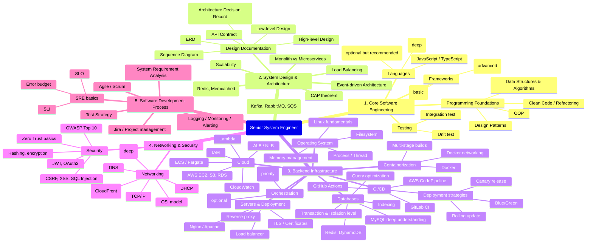

# Senior System Engineer Skill Map

```mermaid
mindmap
  root(Senior System Engineer)
    
    1. Core Software Engineering
      Programming Foundations
        OOP
        Data Structures & Algorithms
        Design Patterns
        Clean Code / Refactoring
      Languages
        Ruby (deep)
        JavaScript / TypeScript
        Go or Java (optional but recommended)
      Frameworks
        Rails (advanced)
        React (basic)
      Testing
        Unit test
        Integration test

    2. System Design & Architecture
      Scalability
      Load Balancing
      Caching (Redis, Memcached)
      Message Queue (Kafka, RabbitMQ, SQS)
      Event-driven Architecture
      Monolith vs Microservices
      CAP theorem
      Design Documentation
        ERD
        Sequence Diagram
        API Contract
        High-level Design
        Low-level Design
        ADR (Architecture Decision Record)

    3. Backend Infrastructure
      Operating System
        Linux fundamentals
        Process / Thread
        Memory management
        Filesystem
      Servers & Deployment
        Nginx / Apache
        Reverse proxy
        Load balancer
        TLS / Certificates
      Databases
        MySQL deep understanding
        Query optimization
        Indexing
        Transaction & Isolation level
        NoSQL (Redis, DynamoDB)
      Cloud
        AWS EC2, S3, RDS
        IAM
        ALB / NLB
        CloudWatch
        ECS / Fargate
        Lambda
      Containerization
        Docker
        Docker networking
        Multi-stage builds
      Orchestration
        ECS (priority)
        Kubernetes (optional)
      CI/CD
        GitHub Actions
        GitLab CI
        AWS CodePipeline
        Deployment strategies
          Blue/Green
          Rolling update
          Canary release

    4. Networking & Security
      Networking
        OSI model
        TCP/IP
        DNS
        DHCP
        HTTP/HTTPS (deep)
        CDN (CloudFront)
      Security
        OWASP Top 10
        Hashing, encryption
        JWT, OAuth2
        CSRF, XSS, SQL Injection
        Zero Trust basics

    5. Software Development Process
      Agile / Scrum
      Jira / Project management
      System Requirement Analysis
      Test Strategy
      SRE basics
        SLI
        SLO
        Error budget
      Logging / Monitoring / Alerting
```